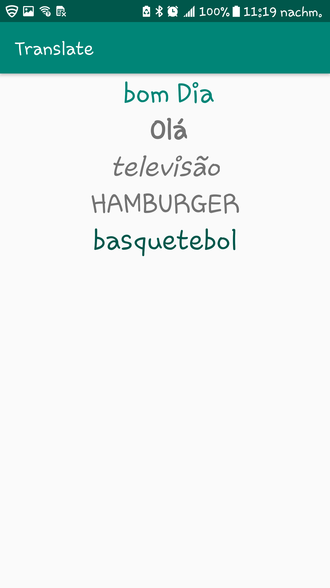

******************  Week 2 Day 3  ************************
Use localization to make 5 different translations for 5 different strings.
Display the 5 strings to 5 different textviews  
Play around with view attributes for textView

Screenshot English

Screenshot French

Screenshot Spanish

Screenshot Italian

Screenshot Portugese

        Translate/Screenshots/English.png
      
